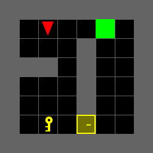

Description
===========
This project is on path planning in gym minigrids with Dynamic Programming

Code organization
=================
* main.py -- Run the script for performing DP on all the environments and generate the policy and value plots.

* utils.py -- contains helper functions to load and render environments 
 
* visualise_tools.py -- contains helper functions for computing optimal control sequence, creating policy and value plots.

Results
=======
  
  

Datasets
========
Test environments provided in envs folder

Parameters
======
All the five actions cost +1. The cost of actions can be changed in the code.

